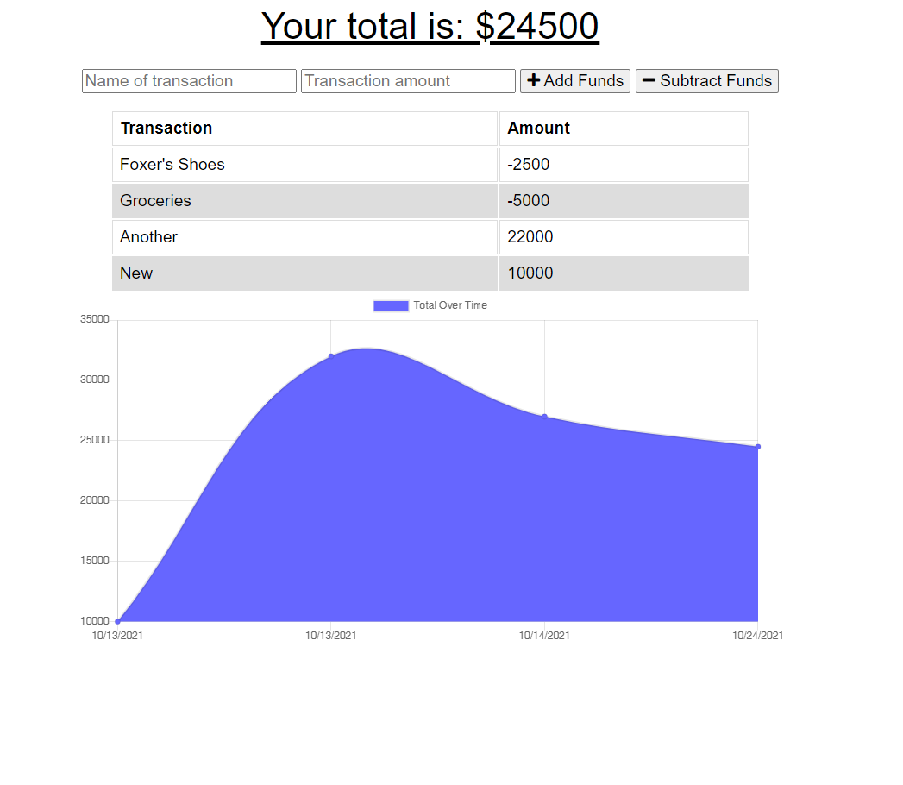

<br />
<br />
<p align="center">


  <h1 align="center">Budget Tracker</h1>

  <p align="center">
    Allowing them to access that information offline with this PWA... Having offline functionality is paramount to the success of an application that handles users’ financial information.
    <br />
    <a href="https://github.com/brandon-stewart-rgb/dance-tsunamis"><strong>Explore the docs »</strong></a>
    <br />
    <br />
    <a href="https://budget--track.herokuapp.com/">VIEW LIVE APP</a>
    ·
    <a href="https://github.com/brandon-stewart-rgb/dance-tsunamis/issues">Report Bug</a>
    ·
    <a href="https://github.com/brandon-stewart-rgb/dance-tsunamis/issues">Request Feature</a>
  </p>
</p>


<!-- TABLE OF CONTENTS -->
<details open="open">
  <summary>Table of Contents</summary>
  <ol>
    <li>
      <a href="#about-the-project">About The Project</a>
      <ul>
        <li><a href="#built-with">Built With</a></li>
      </ul>
    </li>
    <li>
      <a href="#getting-started">Getting Started</a>
      <ul>
        <li><a href="#installation">Installation</a></li>
      </ul>
    </li>
    <li><a href="#usage">Usage</a></li>
    <li><a href="#roadmap">Roadmap</a></li>
    <li><a href="#contributing">Contributing</a></li>
    <li><a href="#license">License</a></li>
    <li><a href="#contact">Contact</a></li>
    <li><a href="#acknowledgements">Acknowledgements</a></li>
  </ol>
</details>


<!-- ABOUT THE PROJECT -->
## About The Project




### Built With

This section should list any major frameworks that you built your project using. Leave any add-ons/plugins for the acknowledgements section. Here are a few examples.
* [Node.js](https://nodejs.com)
* [Express](https://expressjs.com/)
* [Mongoose](https://mongoosejs.com/)
* [Nodemon](https://www.npmjs.com/package/nodemon)
* [morgan](https://www.npmjs.com/package/morgan)

 


<!-- GETTING STARTED -->

### Prerequisites

This is an example of how to list things you need to use the software and how to install them.
* Node.js
  ```sh
  https://nodejs.org/en/
  ```


## Usage

Use this software at your own risk.


<!-- ROADMAP -->
## Roadmap

See the [open issues](https://github.com/brandon-stewart-rgb/dance-tsunamis/issues) for a list of proposed features (and known issues).


<!-- CONTRIBUTING -->
## Contributing

Contributions are what make the open source community such an amazing place to learn, inspire, and create. Any contributions you make are **greatly appreciated**.

1. Fork the Project
2. Create your Feature Branch (`git checkout -b feature/AmazingFeature`)
3. Commit your Changes (`git commit -m 'Add some AmazingFeature'`)
4. Push to the Branch (`git push origin feature/AmazingFeature`)
5. Open a Pull Request


<!-- LICENSE -->
## License

Distributed under the MIT License. See `LICENSE` for more information.


<!-- CONTACT -->
## Contact

Brandon Stewart -  - brandon@brandon.com

Project Link: [https://github.com/brandon-stewart-rgb/dance-tsunamis](https://github.com/brandon-stewart-rgb/dance-tsunamis)


<!-- ACKNOWLEDGEMENTS -->
## Acknowledgements
* [GitHub Emoji Cheat Sheet](https://www.webpagefx.com/tools/emoji-cheat-sheet)
* [Img Shields](https://shields.io)
* [Choose an Open Source License](https://choosealicense.com)
* [GitHub Pages](https://pages.github.com)
* [Font Awesome](https://fontawesome.com)


